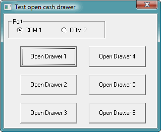



## Open serial cash drawer

### Description

This application has several codes for open a serial cash drawer.

I had a Point of Sale application and need to add this future to it, so after several hours digging and testing several codes, found these.

For me the code behind buttons 3 and 4 works; the app, contains 6 different methods for open a serial cash drawer, hope one of them is right for you.

Tested with Epson receip printer only.
 
### More Info
 

             |
---                |---
**Submitted On**   |2007-10-14 19:12:02
**By**             |[Juan Carlos Pazos](https://github.com/Planet-Source-Code/PSCIndex/blob/master/ByAuthor/juan-carlos-pazos.md)
**Level**          |Beginner
**User Rating**    |5.0 (10 globes from 2 users)
**Compatibility**  |VB 6\.0
**Category**       |[Miscellaneous](https://github.com/Planet-Source-Code/PSCIndex/blob/master/ByCategory/miscellaneous__1-1.md)
**World**          |[Visual Basic](https://github.com/Planet-Source-Code/PSCIndex/blob/master/ByWorld/visual-basic.md)
**Archive File**   |[Open\_seria20870710142007\.zip](https://github.com/Planet-Source-Code/juan-carlos-pazos-open-serial-cash-drawer__1-69491/archive/master.zip)

